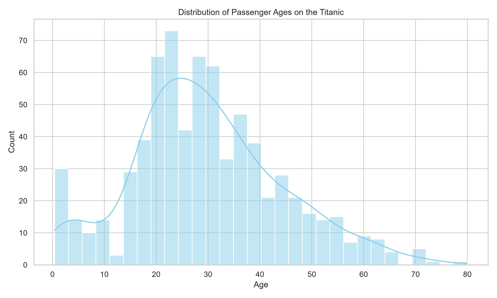
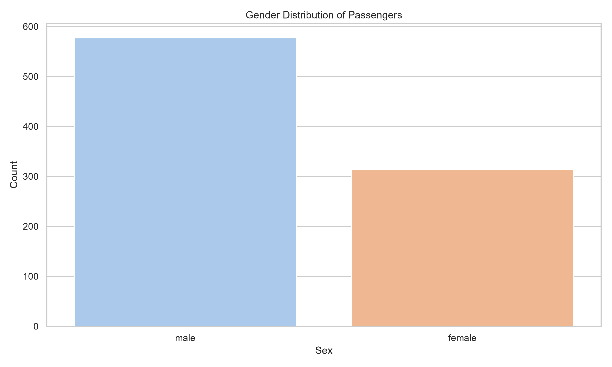
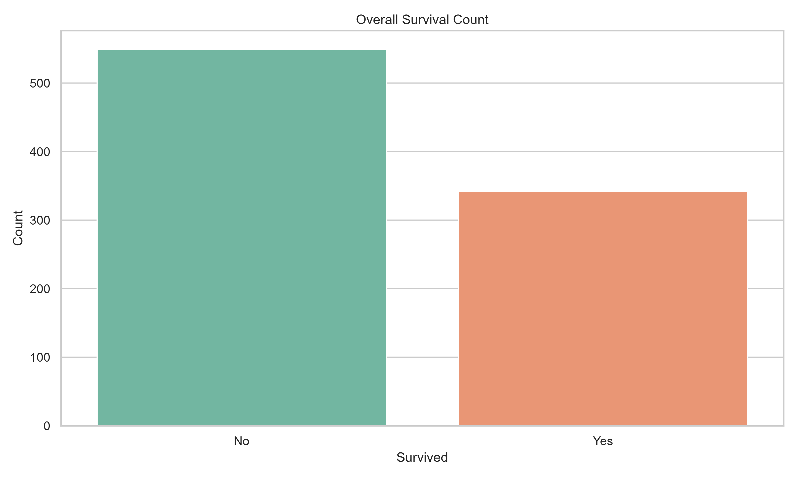
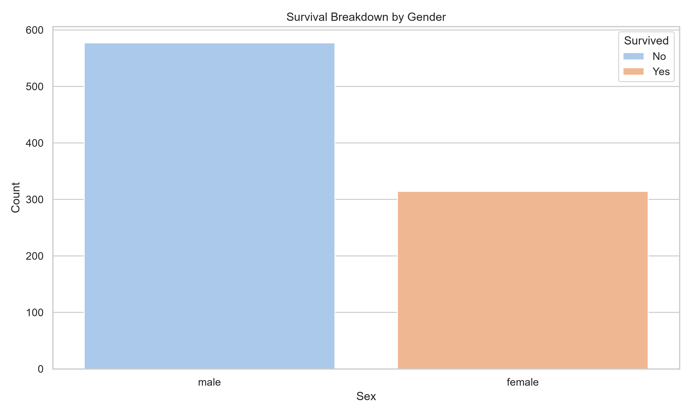
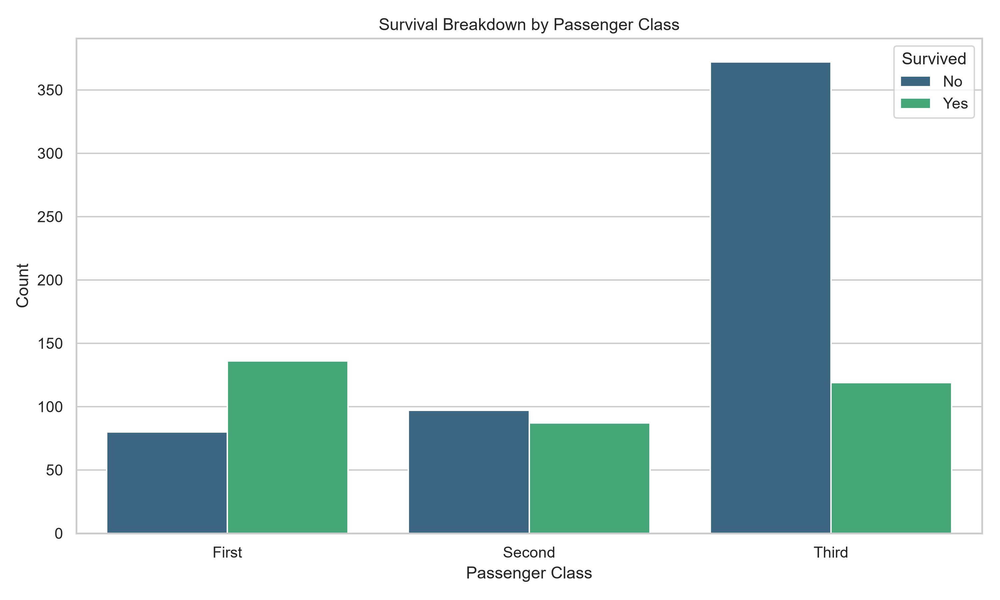
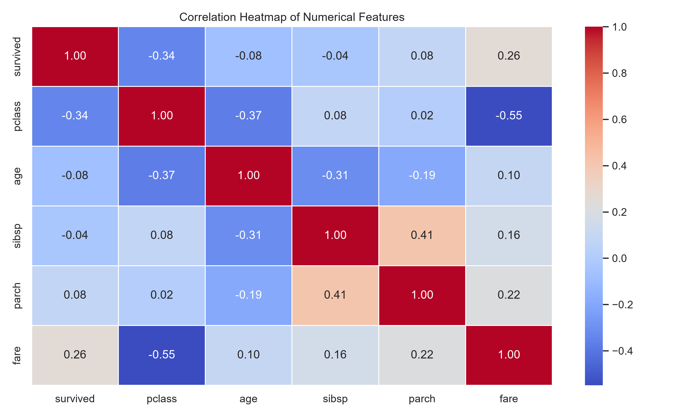

# 🚢 Titanic EDA (Exploratory Data Analysis) Project

This project performs **Exploratory Data Analysis (EDA)** on the classic Titanic dataset to uncover patterns, trends, and factors influencing passenger survival.

The project automatically loads the dataset, analyzes key features, and generates insightful visualizations to understand passenger demographics, survival rates, and feature correlations.

---

## 📂 Project Structure

```text
Titanic-EDA-Project/
│
├── eda_titanic.py
├── requirements.txt
├── README.md
│
├── outputs/
│   ├── age_distribution.png
│   ├── gender_distribution.png
│   ├── survival_distribution.png
│   ├── survival_by_gender.png
│   ├── survival_by_class.png
│   └── correlation_heatmap.png
```

---

## 📌 Project Objectives

The objectives of this project are to:

- Understand the structure of the Titanic dataset.
- Perform statistical analysis.
- Identify missing values.
- Visualize feature distributions.
- Analyze relationships between variables.
- Identify factors influencing passenger survival.
- Develop analytical thinking and data exploration skills.

---

## 🛠 Technologies Used

- Python 3.x
- Pandas
- NumPy
- Matplotlib
- Seaborn
- Scikit-learn

---

## 🚀 Getting Started

### 1. Clone the Repository

```bash
git clone https://github.com/YOUR_USERNAME/Titanic-EDA-Project.git

cd Titanic-EDA-Project
```

Replace `YOUR_USERNAME` with your GitHub username.

---

### 2. Create a Virtual Environment

#### Windows

```bash
python -m venv venv
venv\Scripts\activate
```

#### Linux / macOS

```bash
python3 -m venv venv
source venv/bin/activate
```

---

### 3. Install Dependencies

```bash
pip install -r requirements.txt
```

---

### 4. Run the EDA Script

```bash
python eda_titanic.py
```

The script will automatically load the Titanic dataset and generate all visualizations inside the **outputs/** folder.

---

# 📊 Generated Visualizations

### Age Distribution

Shows the distribution of passenger ages.



---

### Gender Distribution

Displays the number of male and female passengers.



---

### Survival Distribution

Shows the count of survivors and non-survivors.



---

### Survival by Gender

Compares survival rates between male and female passengers.



---

### Survival by Passenger Class

Illustrates the impact of passenger class on survival.



---

### Correlation Heatmap

Displays correlations among numerical features.



---

## 🔍 Key Findings

- Female passengers had significantly higher survival rates.
- First-class passengers had better chances of survival.
- Younger passengers tended to survive more frequently.
- Ticket fare showed a positive relationship with survival.
- Missing values were mainly observed in the Age and Deck features.

---

## 🎯 Conclusion

This project demonstrates the importance of Exploratory Data Analysis (EDA) in understanding datasets, discovering hidden patterns, and supporting data-driven decision-making.

EDA is a crucial step before applying machine learning models and helps analysts gain meaningful insights from raw data.

---

## 👨‍💻 Author

**Rajwant Raj**


---
⭐ If you found this project useful, consider giving it a star on GitHub.
